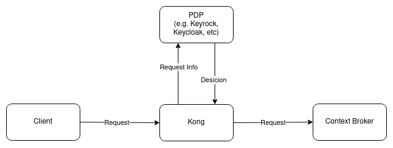

# Kong PEP-Plugin

Plugin for [Kong](https://konghq.com/) to support the usage of Kong as a [PEP-Proxy](https://github.com/FIWARE/tutorials.PEP-Proxy). The current implementation supports [Keyrock](https://github.com/ging/fiware-idm) as descion point.

## How it works.



The Kong plugin can be configured to work with different policy desicion points(PDP). It will translate the request into the expected format and enrich it with required information(f.e. app-id). The request-info will be forwarded to the PDP. The plugin interprets the response, depending on the type and provides a desicion. For better performance, this desicion can be cached. The Kong-PEP-Plugin does only handle bearer-tokens in the ```Authorization```-header. 

## Configuration

| Key| Description | Default |Required|Allowed values|
|----|-------------|---------|--------|--------------|
|authorizationendpointtype| Type of the desicion point. | ```nil```| ```true```| ```Keyrock``` |
|authorizationendpointaddress| Url to be contacted for authorization. F.e. https://keyrock.dev/users | ```nil```| ```true```| type.URL |   
|keyrockappid| Id of the app in Keyrock that should be checked. | ```nil```| ```true``` in case of type ``Keyrock```| type.String |
|decisioncacheexpiryins| How fast should the desicion cache expire? Caching is disabled if set to -1 | ```60``` | ```false``` | type.Int64|   

Example config:

```yaml
    services:
      - host: "orion-ld"
        name: "orion-oidc"
        port: 1026
        protocol: http

        routes:
          - name: orion-oidc
            paths:
              - /orion
            strip_path: true

        plugins:
          - name: pep-plugin
            config:
              authorizationendpointtype: Keyrock
              authorizationendpointaddress: https://keyrock.fiware.dev/user
              keyrockappid: 7c902139-d4d0-461a-bb14-7fa29aa143fe
              decisioncacheexpiryins: 20
```

The configuration above will apply the plugin to all requests on path ```/orion```. The requests will be authorized using Keyrock, running at ```https://keyrock.fiware.dev/user```. The ID of the secured app(```orion-ld```) is set in ```keyrockappid``` and the decisions will be cached for 20s.

## Decision caching

Decision caching is a mechanism to improve performance for requests from the same client to the same endpoint, as for example IOT-Sensors updating their values. If enabled, the proxy will keep positive(e.g. allowed) desicion in cache for a configured time and does not request a new decision on the PDP for such calls. It only holds positive decisions, to not cache (in-correct) denies on f.e. connection issues. 

### Security considerations

From a security perspective, the usage of the cache needs to be carefully considered. The authz information will not be reevaluated in the frequence configured in the token, but instead based on the cache-configuration. If the cache-expiry is set to high, this will diminish the strength of the token-based security, since a stolen token can be reused longer than configured inside the IDM-system. Changed permissions on a role(f.e. permit write to certain accounts) will not immediatly take place, but only after cache-expiry. 
Immediate effect with caching can be achived with a downtime. Since the cache exists in-memory, reloading Kong will expire all decisions and can be used in such cases. 